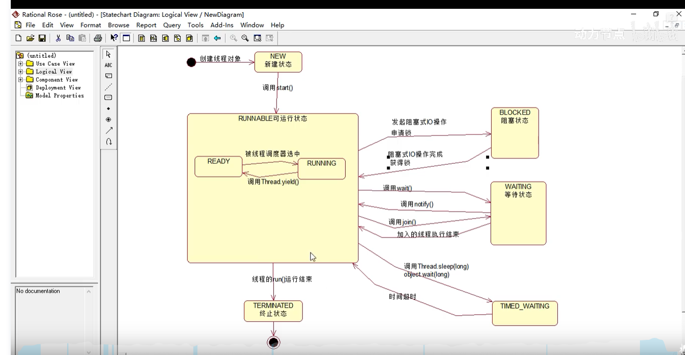
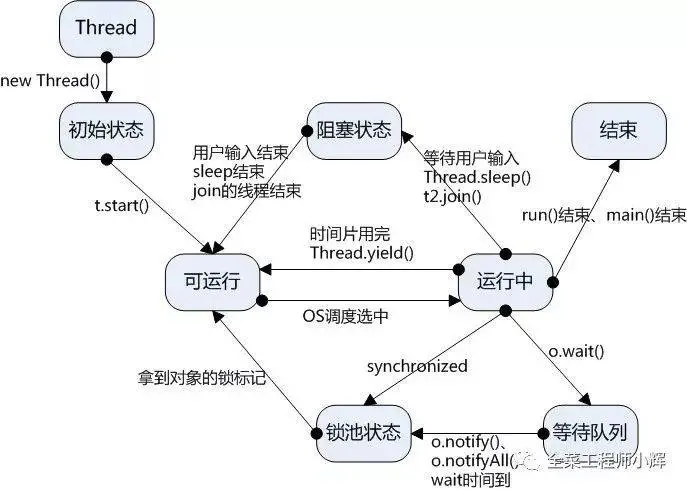
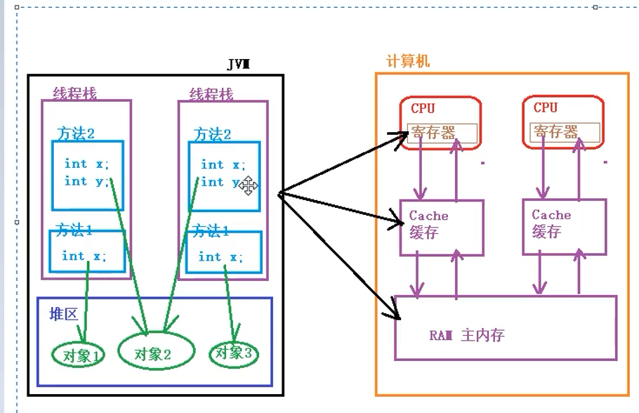
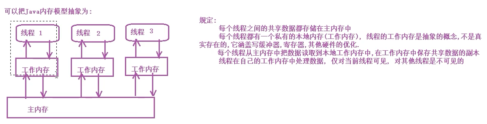
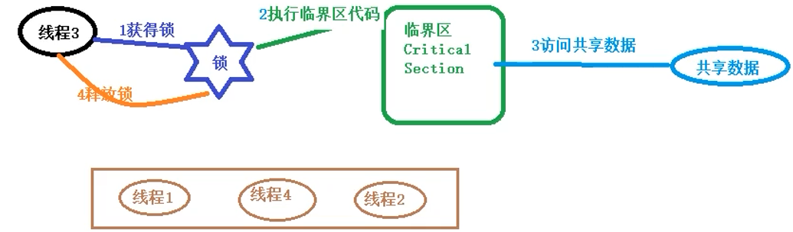
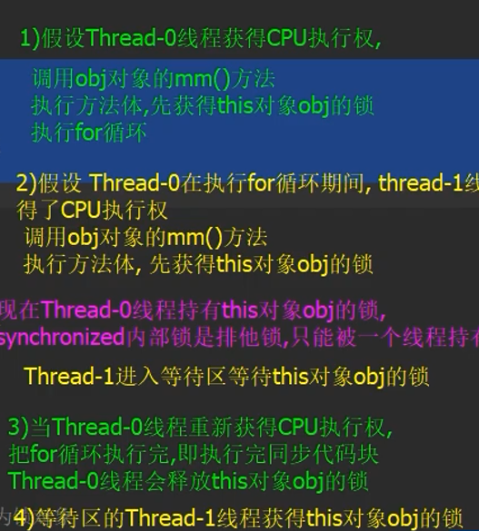
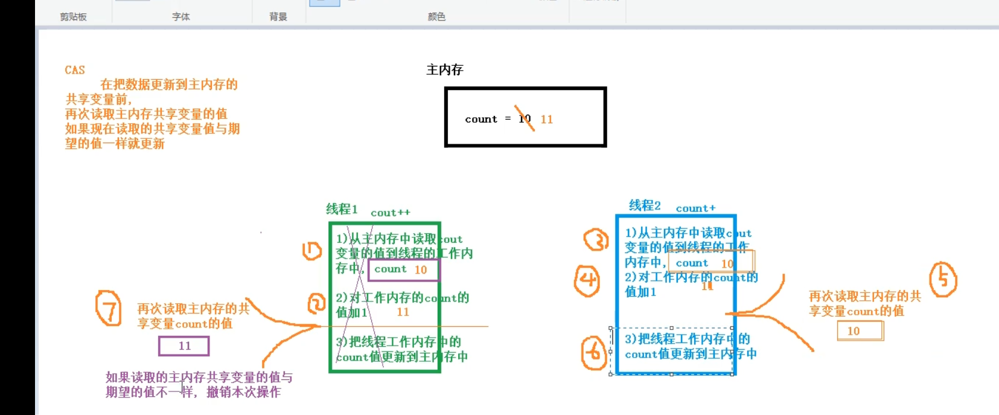

# 一、相关概念

**进程（process）**：计算机中的程序关于某数据集合一次运行活动。是资源分配的最小单位

**线程（thread）**：是进程的一个执行单元，CPU调度的最小单位。

二者关系：

1>一个进程可以包含多个线程。

2>进程是线程的容器。


**jvm中的主线程与子线程**：

jvm启动时会创建一个主线程，该线程负责执行main方法。


**子线程、父线程**：如果我们在A线程中创建了一个B线程，那么A线程时B线程的父线程，B线程是A的子线程。


**串行（sequential）：**多个任务顺序执行


**并行（parallel）：**多个任务同时进行执行


**并发（concurrent）：**是指一个时间段中有几个程序都处于已启动运行到运行完毕之间，且这几个程序都是在同一个处理级上运行，但任一个时刻点上只有一个程序在处理机上运行。

# 二、Java中使用线程

## 2.1线程的创建和启动

**创建线程两种方式：**

1>定义thread类的子类

2>实现一个runnable接口

注意：两种方式等价

**启动线程**

1.创建子线程对象

2.使用start（）方法启动线程

注意：	

1. start方法只是告诉jvm需要创建一个新线程，具体什么时候执行由线程调度器决定。
2. run方法体里面是具体线程执行的代码。

## 2.2线程常用方法

注意：使用Thread说明是静态方法，thread是指具体线程使用的方法

```java
Thread.currentThread()
//获取当前线程
```

例如：使用main线程创建一个线程，当前线程就是main线程。

同理可得其他线程创建，因此方法中的this指的是创建线程


```java
thread.setName("sqs");//为线程设置名称

thread.getName("sqs");//获取线程名称

thread.getId()//获取线程id
```


```java
thread.isAlive()//判断线程是否存在
```


```java
Thread.sleep();//使当前线程睡眠		
```


```java
thread.getId()//获取线程id
```

注：

1>id是线程的唯一标识，线程使用完毕以后，id可能分配给后续线程。

2>重启JVM后，同一线程的id可能不同（那不是很正常）


```java
Thread.yield();//让当前线程放弃cpu资源
```

 

```java
thread.interrupt()//给子线程标记中断
```

注意：可以在线程的run方法中使用thread.isInterrupt()来判断interrupt标志量来决定是否中断进程。


```java
thread.setDaemon(true);//设置线程为守护线程
```

注：

1>守护线程是指为其他线程服务的线程，例如JVM里面的GC，当线程中只有守护线程的时候，JVM会关闭。

2>应该在线程启动之前设置


```java
thread.getState();//获取线程的状态，返回值为枚举类型
```

注：

new：新建状态，在调用start之前的状态
runnable：可运行状态，包含ready和running两个转台，ready表示可调度状态,running表示线程正在运行

blocked：阻塞状态

waiting：等待状态，线程执行了object.wait(),thread.join().方法会把线程转换为waiting状态，执行object.notify()方法，或者加入的线程执行完毕，当前线程会转化为runnable。

time_waiting：指定时间范围内等待，超过时间，该线程自动转化为runnable


terminated：终止状态






## 2.3多线程的优势与风险

**优势:**

1)**提高系统的吞吐率(Throughout)**. 多线程编程可以使一个进程
有多个并发(concurrent，即同时进行的)的操作
2)**提高响应性(Responsiveness)**.Web服务器会采用一-些专门的线
程负责用户的请求处理缩短了用户的等待时间
3)**充分利用多核(Multicore)**处理器资源.通过多线程可以充分的
利用CPU资源

**风险：**

1)**线程安全**(Thread safe)问题多线程共享数据时,如果没有采取
正确的并发访问控制措施,就可能会产生数据一致性问题,如读取脏数 
据(过期的数据)，如丢失数据更新.
2)**线程活性**(thread liveness)问题.由于程序自身的缺陷或者由资
源稀缺性导致线程一直处于非RUNNABLE状态,这就是线程活性问题,
常见的活性故障有以下几种:
	​   (a)死锁(Deadlock).类似鹬蚌相争
	​	(b)锁死(Lockout),类似于睡美人故事中王子挂了
	​	(c)活锁(Livelock).类似于小猫咬自己尾巴
	​	(d)饥饿(Starvation).类似于健壮的雏鸟总是从母鸟嘴中抢到食物.

3)**上下文切换(**Context Switch).处理器从执行一个线程切换到执
  行另外- -个线程
4)**可靠性.**可能会由一个线程导致JVM意外终止，其他的线程也
  无法执行.

# 三、线程安全问题

非线程安全主要是指多个线程对同一个对象的实例变量进行操作
时，会出现值被更改,值不同步的情况.

线程安全问题表现为三个方面:**原子性,可见性和有序性**


## 3.1原子性（atomic）

1. 原子(Atomic)就是不可分割的意思.原子操作的不可分割有两层
   **含义:**
   1)访问(读, 写)某个共享变量的操作从其他线程来看,该操作要
   么已经执行完毕，要么尚未发生,即其他线程年示到当前操作的中
   间结果
   2)访问同一组共享变量的原子操作是不能够交错的


2. Java有两种方式实现原子性: 

   一种是使用**锁**;

   另一种利用处理器的**CAS指令**（相当于硬件锁）

3. 在java中提供了一个线程安全的AtomicInteger类，保证了操作的原子性

## 3.2可见性

​	在多线程环境中,一个线程对某个共享变量进行更新之后,后续其他的线程可能无法立即读到这个更新的结果,这就是线程安全间
题的另外一种形 式:**可见性(visibility)**

​	如果一个线程对共享变量更新后,后续访问该变量的其他线程可以读到更新的结果,称这个线程对共享变量的更新对其他线程可见

​	多线程程序因为可见性问题可能会导致其他线程读取到了旧数据(脏数据)


可能会出现以下情况:
	在main线程中调用了task. cancel()方法，把task对象的toCancel变量修改为true
	可能存在子线程看不到main线程对toCancel做的修改,在子线程中toCancel变量-直为false导致子线程看不到main线程对toCancel变量更新的原因,可能:

1. JIT即时编译器可能会对run方法中while循环进行优化为:
   
   ```
   if( !toCancel ){
   while ( true){
   if (doSomething()){
   }
   }
   }
   ```
   
   2)可能与计算机的存储系统有关。假设分别有两个cpu内核运行main线程与子线程，
   运行子线程的cpu无法立即读取运行main线程Cpu中的数据

## 3.3有序性（ordering）

​	有序性(Ordering)是指在什么情况下一个处理器上运行的一一个线程所执行的内存访问操作在另外一个处理器运行的其他线程看来是乱序的(Out of Order).

**乱序**：是指内存访问操作的顺序看起来发生了变化

**重排序：**在多核处理器的环境下编写的顺序结构，这种操作执行的顺序可能是没有保障的.

编译器可能会改变两个操作的先后顺序;
处理器也可能不会按照目标代码的顺序执行;

这种一个处理器.上执行的多个操作,在其他处理器来看它的顺序
与目标代码指定的顺序可能不一样这种现象称为重排序.

重排序是对内存访问有序操作的一种优化,可以在不影响单线程程序正确的情况下提升程序的性能.但是，可能对多线程程序的正确性产生影响,即可能导致线程安全问题

重排序与可见性问题类似,不是必然出现的.


与内存操作顺序有关的几个概念:
源代码顺序,就是源码中指定的内存访问顺序.
**程序顺序：**处理器上运行的目标代码所指定的内存访问顺序
**执行顺序：**内存访问操作在处理器.上的实际执行顺序
**感知顺序：**给定处理器所感知到的该处理器及其他处理器的内存访问操作的顺序


可以把重排序分为指令重排序与存储子系统重排序两种.

指令重排序主要是由JIT编译器，处理器弓|起的,指程序顺序与执行顺序不一样

存储子系统重排序是由高速缓存,写缓冲器弓|起的,感知顺序与执行顺序不一致

### 3.3.2指令重排序

在源码顺序与程序顺序不一致，或者 程序顺序与执行顺序不一致的情况下我们就说发生了指令重排序(Instruction Reorder).

指令重排是一种动作,确实对指令的顺序做了调整,重排序的对象指令.

javac编铎器一般不会执行指令重排序, 而JIT编译器可能执行指令重排序


处理器也可能执行指令排序，是的执行顺序与程序顺序不一致。


注意：指令重排不会对单线程程序的结果产生影响，但是会对多线程程序造成影响。


### 3.3.3存储子系统重排

  存储子系统是指写缓冲器与高速缓存.

   高速缓存(Cache)是CPU中为了匹配与主内存处理速度不匹配而设
计的一个高速缓存

   写缓冲器(Store buffer, Write buffer)用来提高写高速缓存操作的效率

   即使处理器严格按照程序顺序执行两个内存访问操作,在存储子系统的作用下，其他处理器对这两个操作的感知顺序与程序顺序不一致,即这两个操作的顺序顺序看 起来像是发生了变化，这种现象称为**  **


从处理器角度来看,读内存就是从指定的RAM地址中加载数据到寄存器,称为Load操作;写内存就是把数据存储到指定的地址表示的RAM存储单元中,称为Store操作，内存重排序有以下四种可能:
**Load-Load重排序**,一个处理器先后执行两个读操作L1和L2，其他处理器对两个内存操作的感知顺序可能是L2->L1

**Store-Store重排序**，一个处理器先后执行两个写操作 W1和W2,其他
处理器对两个内存操作的感知顺序可能是W2->W1

**Load-Store重排序**,一个处理器先执行读内存操作L1再执行写内存
操作W1,其他处理器对两个内存操作的感知顺序可能是W1->L1

**Store-load重排序**,一个处理器先执行读内存操作L1再执行写内存
操作W1,其他处理器对两个内存操作的感知顺序可能是W1->L1

注意：内存重排序与具体的处理器微架构有关,不同架构的处理器所允许的内存重排序不同


### 3.3.4貌似串行语义

  

JIT编译器，处理器,存储子系统是按照一 定的规则对指令,内存操作个的结果进行重排序，给单线程程序造成一种假象，指令是按照源码的顺序执行的这种假象称为貌似串行语义.并不能保证多线程环境程序的正确性

为了保证貌似串行语义，有数据依赖关系的语句不会被重排序,只有不存在数据依赖关系的语句才会被重排序如果两个操作(指令)访问同一个变量,且其中一个操作(指令)为写操作,那么这两个操作之间就存在数据依赖关系(Data dependency).
如:
x=1;y=x+1;后一条语句的操作数包含前一条语句的执行结果

如果不存在数据依赖关系则可能重排序,如:
double price= 45.8;
int quantity= 10;
double sum = price *quantity;

存在控制依赖关系的语句允许重排-条语句(指令)的执行结果会决定另一条语句(指令)能否被执行，这两条语句(指令)存在控制依赖关系(Control Dependency).


### 3.3.5保证内存访问的顺序性

可以使用volatile，synchronize关键字保证代码的顺序性


## 3.4 Java内存模型





1)每个线程都有独立的栈空间

2)每个线程都可以访问堆内存

3)计算机的CPU不直接从主内存中读取数据，CPU读取数据时, 先把主内存的数据读到Cache缓存中，把Cache中的数据读到Register寄存器中
4)JVM中的共享的数据可能会被分配到Register寄存器中每个CPU都有自己的Register寄存器，一个CPU不能读取其他CPU上寄存器中的内容.如果两个线程分别运行在不同的处理器(CPU).上,而这个共享的数据被分配到寄存器上,会产生可，见性问题.

5)即使JVM中的共享数据分配到主内存中,也不能保证数据的可见性. CPU不直接对主内存访问，而是通过Cache高速缓存进行的.一个处理器上运行的线程对数据的更新可能只是更新到处理器的写缓冲器(Store Buffer), 还没有到达Cache缓存,更不用说主内存了.另外- -个处理器不能读取到该处理器写缓冲器上的内容，会产生运行在另外- -个处理器上的线程无法看到该处理器对共享数据的更新.

6)-个处理器的Cache不能直接读取另外-个处理器的Cache.但是一个处理器可以通过缓存一致性协议(Cache Coherence Protoco1)来读取其他处理器缓存中的数据，并将读取的数据更新到该处理器的Cache中.这个过程称为缓存同步.缓存同步使得一个处理器上运行的线程可以读取到另外一个处理器上运行的线程对共享数据的所做的更新,即保障了可见性.为了保障可见性,必须使一个处理器对共享数据的更新最终被写入该处理器的Cache,这个过程称为冲刷处理器缓存.




# 四、线程同步机制


## 4.1线程同步机制简介

线程同步机制是-套用于协调线程之间的数据访问的机制.该机。制可以保障线程安全.

Java平合提供的线程同步机制包括:**锁**，**volatile关键字**，**final关键字**,**static关键字**，以及相关的API,如**Object.wait()/Object.notify()**等


## 4.2 锁（lock）


**概述：**线程安全问题的产生前提是多个线程并发访问共享数据.

将多个线程对共享数据的并发访问转换为串行访问,即一一个共享数据一次只能被一个线程访问.锁就是利用这种思路来保障线程安全


**注：**

1、锁(Lock)可以理解为对共享数据进行保护的一个许可证.对于同-个许可证保护的共享数据来说，

任何线程想要访问这些共享数据必须先持有该许可证.

一个线程只有在持有许可证的情况下才能对这些共享数据进行访问;并且一个许可证一次只能被一个线程持有;

许可证线程在结束对共享数据的访问后必须释放其持有的许可证.

2、一线程在访问共享数据前必须先获得锁;获得锁的线程称为锁的持有线程; 

- 一个锁一次只能被一个线程持有.
- 锁的持有线程在获得锁之后和释放锁之前这段时间所执行的代码称为**临界区**(CriticalSection).

3.使用锁的流程图



### 4.2.1 Java中的锁

**种类**：内部锁（sychronized关键字）、显示锁(java.concurrent.locks.lock)

### 4.2.2 锁的作用


**锁的原理：**锁可以实现对共享数据的安全访问.保障线程的原子性，可见性与有序性.

​		**锁是通过互斥保障原子性.** 一个锁只能被一个线程持有,这就保证临界区的代码一次只能被一个线程执行使得临界区代码所执行的操作自然而然的具有不可分割的特性,即具备了原子性.

​		**可见性的保障是通过写线程冲刷处理器的缓存和读线程刷新处理器缓存这两个动作实现的**.在java平台中，锁的获得隐含着刷新处理器缓存的动作，锁的释放隐含着冲刷处理器缓存的动作

​	**锁能够保障有序性**.写线程在临界区所执行的在读线程所执行的临界区看来像是完全按照源码顺序执行


 **注意：**

使用锁保障线程的安全性，必须满足以下条件:

1、这些线程在访问共享数据时必须使用

2、同一个锁即使是读取共享数据的线程也需要使用同步锁

### 4.2.3 锁的相关概念

**1)可重入性**
	可重入性(Reentrancy)描述这样一个问题: 一个线程持有该锁的时候能再次(多次)申请该锁

​	如果一个线程持有一个锁的时候还能够继续成功申请该锁，称该锁是可重入的,否则就称该锁为不可重入的

**2)锁的争用与调度**
	Java平台中内部锁属于非公平锁，显示Lock锁既支持公平锁又支持非公平锁

**3）锁的粒度**

​	一个锁可以保护的共享数据的数量大小叫做锁的粒度

​	锁保护共享数据量大,称该锁的粒度粗,否则就称该锁的粒度细、

​    **锁的粒度过粗会导致线程在申请锁时会进行不必要的等待.锁的粒度过细会增加锁调度的开销**

### 4.3.3 内部锁：synchronize关键字

​	Java中的每个对象都有一一个与之关联的**内部锁(Intrinsic lock)**。这种锁也称为**监视器(Monitor)**这种内部锁是一种排它锁，可以保障原子性，可见性与有序性

内部锁是通过synchronized关键字实现的.synchronized关键字修饰代码块,修饰该方法.

修饰代码块的语法:
	synchronized(对象锁){
			同步代码块，可以在同步代码块中访问共享数据
		}

	修饰实例方法就称为同步实例方法
	修饰静态方法称称为同步静态方法

```java
public class test01 extends Thread {
    public void mm() {
        synchronized (this) {
            for (int i = 1; i <= 100; i++) {
                System.out.println(Thread.currentThread().getName() + "--->" + i);
            }
        }
    }

    public static void main(String[] args) {
        test01 test01 = new test01();
        new Thread(new Runnable() {
            @Override
            public void run() {
                test01.mm();
            }
        }).start();
        new Thread(new Runnable() {
            @Override
            public void run() {
                test01.mm();
            }
        }).start();
    }
}
```



注意：

1. synchronize锁对象不同，锁不能共享

2. 可以使用常量对象作为锁对象

```java
public static final Object OBJ = new Object();
```

3. 不管是实例方法还是静态方法，只要是synchronize修饰同一个对象，都可以实现同步
4. 使用synchronized修饰静态方法，同步静态方法，默认运行时类作为锁对象

```java
package com.sqs.p4;

public class test04 extends Thread {

    public void mm() {
        synchronized (test04.class) {
            for (int i = 1; i <= 100; i++) {
                System.out.println(Thread.currentThread().getName() + "--->" + i);
            }
        }
    }

    public synchronized static void mm2() {
        synchronized (test04.class) {
       //通过反射将整个类的运行实例都上锁
            for (int i = 1; i <= 100; i++) {
                System.out.println(Thread.currentThread().getName() + "--->" + i);
            }
        }
    }


    public static void main(String[] args) {
        test04 OBJ = new test04();
        new Thread(new Runnable() {
            @Override
            public void run() {
                OBJ.mm2();
            }
        }).start();
        new Thread(new Runnable() {
            @Override
            public void run() {
                OBJ.mm();
            }
        }).start();
    }
}
```

5. 同步过程中产生了异常，对象会自动释放锁对象

   

## 4.3 轻量级同步机制volatile关键字

 

**作用：**volatile的作用可以强制线程从公共内存中读取变量的值


**volatile与synchronized比较**

1) volatile 关键字是线程同步的轻量级实现，**所以volatile性能肯定比synchronized要好**; **volatile 只能修饰变量**,而synchronized可以修饰方法,代码块.随着 JDK新版本的发布,synchronized的执行效率也有较大的提升，**在开发使用sychronized的比率还是很大的.**

2) 多线程访问volatile变量不会发生阻塞而**synchronized可能会阻塞**

3) volatile 能保证数据的可见性,但是不能保证原子性;**synchronized可以保证原子性**，也可以保证可见性

4) 关键字volatile解决的是变量在多个线程之间的可见性 synchronized关键字解决多个线程之间访问公共资源的同步性.


## 4.4 CAS

CAS(compare and swap)是由硬件实现

CAS可以将read- modify - write这类的操作转换为原子操作.i++自增操作包括三个子操作:
1.读取i变量值
2.对i的值加1
3.保存到主内存

**原理：**在把数据更新到主内存时,再次读取主内存变量的值,如果现在变量的值与期望的值(操作起始时读取的值)一样就更新.

注：原子类的底层就是采用cas机制来保障原子性



### CAS的ABA问题

​	cAS 实现原子操作背后有一个假设:共享变量的当前值与当前线程提供的期望值相同，就认为这个变量没有被其他线程修改过.实际上这种假设不一定总是成立.

​	如有共享变量count = 0

​	A线程对count值修改为10

​	B线程对count值修改为20

​	c线程对count值修改为0当前线程看到count

当前线程看到count变量的值现在是0,现在是否认为count变量的值没有被其他线程更新呢?这种结果是否能够接受

即共享变量的值由A->B->A,是否判定为共享变量值的改变

解决方法：给共享变量添加一个时间戳，每次比对共享变量还要比较时间戳是否改变。

如：A[0]->B[1]->A[2]

## 4.5原子变量类

​		原子变量类基于cAS实现的，当对共享变量进行read-modify-write更新操作时,通过原子变量类可以保障操作的原子性与可见性.对变量的read-modify-write更新操作是指当前操作不是一个简单的赋值,而是变量的新值依赖变量的旧值,如自增操作i++．由于volatile只能保证可见性,无法保障原子性，原子变量类内部就是借助一个volatile变量,并且保障了该变量的read-modify-write操作的原子性，有时把原子变量类看作增强的volatile变量.原子变量类有12个,如:

| 分组       |                                                              |
| ---------- | ------------------------------------------------------------ |
| 基础型     | Atomiclnteger,AtomicLong, AtomicBoolean                      |
| 数组型     | AtomiclntegerArray,AtomicLongArray,AtomicReferenceArray      |
| 字段更新器 | AtomiclntegerFieldUpdater,AtomicLongFieldUpdater,AtomicReferenceFieldUpdater |
| 引用型     | AtomicReference,AtomicStampedReference,AtomicMarkableReference |

### 4.5.1 AtomicLong

使用原子变量类定义一个计数器
该计数器,在整个程序中都能使用,并且所有的地方都使用这一个计数器,这个计数器可以设计为单例


# 五、线程间的通信

# 5.1线程间通信的方法

1. **volatile**

volatile有两大特性，一是可见性，二是有序性，禁止指令重排序，其中可见性就是可以让线程之间进行通信。

volatile语义保证线程可见性有两个原则保证

- 所有volatile修饰的变量一旦被某个线程更改，必须立即刷新到主内存
- 所有volatile修饰的变量在使用之前必须重新读取主内存的值

1. **等待/通知机制**

2. **join方式**

3. **threadLocal**

   

## 5.2 等待/通知机制

### 5.2.1**等待/通知机制：**	


### 5.2.2**等待/通知机制实现：**

Object类中的wait()方法可以使执行当前代码的线程等待,暂停执行,直到接到通知或被中断为止.

1. wait()方法只能在同步代码块中由锁对象调用

2. **调用wait()方法，当前线程会释放锁**

  其伪代码如下:

  

  ```
  //在调用wait()方法前获得对象的内部锁
  synchronized(锁对象){
  	while(条件不成立){
  	 //通过对象调用wait()方法暂停线程
  	 锁对象.wait();
  	}
  	//线程条件满足了继续执行
  ```

 3.Object类的notify()可以唤醒线程,该方法也必须在同步代码块中由锁对象调用.没有使用锁对象调用wait()/notify()会拋出
lllegalMonitorStateExeption异常.如果有多个等待的程,notify()方法只能唤醒其中的一个.

4.在同步代码块中调用notify()方法后，**并不会立即释放锁对象,需要等当前同步代码块执行完后才会释放锁对象,**

```

synchronized(对象){
	改变条件
	对象. notifyAll();
	}

```

### 5.2.3 interrupt方法

可以中断wait()方法


### 5.2.4 notify()与notifyAll()方法wait(long)方法

notify()随机唤醒一个wait()线程，notifyAll()唤醒所有wait()线程，wait(long)方法等待指定时间，自动唤醒


### 5.2.5生产者和消费者模式

生产数据对应生产者

消费数据对应消费者

## 5.3 join()

